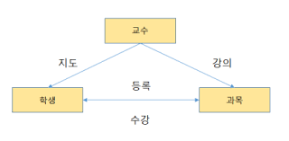
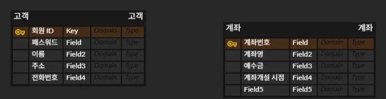
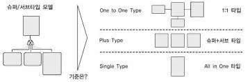

# Part 2. 데이터 모델링의 이해

## Section 1. 데이터 모델링(Data Modeling)

### 데이터 모델링

: 현실 세계를 데이터 베이스로 표현하기 위해 추상화

→ 고객의 업무 프로세스를 이해한 후 데이터 모델링 표기법을 사용해 모델링 ⇒ 복잡X, 이해하기 쉽게

→ 업무 프로세스를 추상화하고, 소프트웨어를 분석, 설계하면서 점점 상세

→ 정의된 비즈니스 규칙을 데이터 모델로 표현

→ 특징

- 추상화(Abstraction) - 간략하게 표현
- 단순화(Simplification) - 누구나 쉽게 이해
    
    ⇒ 추상화와 단순화
    
    모델링을 수행 할 때 세부적인 요소보다, 전체적인 모습 파악 위해 수행
    
    (세부적인 요소에 집중되면 초기 모델링이 복잡해져 이해 어려움)
    
- 명확성(Clarity) - 명확하게 의미가 해석되어야 하고 한 가지 의미만 가짐

→ 단계

[1] 개념적 모델링(Conceptual Data Modeling)

- 고객의 비즈니스를 분석하고 업무 전체에 대해 모델링 수행
    
    ⇒ 전사적 관점에서 기업 데이터 모델링
    
- 복잡하게 표현하지 않고 중요한 부분을 위주로 모델링하는 단계 (기술적 용어 사용X)
    
    ⇒ 추상화 수준 가장 높은 모델링
    
- 엔터티(Entity)와 속성(Attribute) 도출하고 개념적 ERD(Entity Relationship Diagram) 작성
    
     ⇒ 모델과 관계없이 업무 측면에서 모델링 
    

[2] 논리적 모델링(Logical Data Modeling)

- 개념적 모델링을 논리적 모델링으로 변환하는 작업, 업무 관점에서 작성된 모델링을 데이터 베이스 모델의 종류에 따라 변환한다는 것으로, 칼럼, 행, 테이블 등의 형태로 변환
- 식별자를 도출하고 필요한 모든 릴레이션(테이블) 정의하고, 대표성 있는 키 식별
- 정규화를 실행해 데이터 모델의 독립성 확보
    - 정규화 : 독립적인 단위로 릴레이션 분리 ⇒ 재사용성 높임

[3] 물리적 모델링(Physical Modeling)

- 데이터 베이스를 실제로 구축(테이블, 인덱스, 함수 등 생성)
- 성능, 보안, 가용성 고려하여 구축

→ 데이터 모델링 관점

- 데이터
    - 비즈니스 프로세서에서 사용되는 데이터 의미
    - 구조 분석, 정적 분석
- 프로세스
    - 비즈니스 프로세스에서 수행하는 작업 의미
    - 시나리오 분석, 도메인 분석, 동적 분석
- 데이터와 프로세스
    - 프로세스와 데이터 간의 관계 의미
    - CRUD(Create, Read, Update, Delete)분석

⇒ 업무(프로세스)에서 데이터가 어떻게 사용되는지 파악하는 것

이를 위해 CRUD 매트릭스 작성

→ CRUD(Create, Read, Update, Delete) 매트릭스

| 프로세스/관점 | 회원 | 상품 |
| --- | --- | --- |
| 회원 등록 | C |  |
| 회원 변경 | R ,U |  |
| 주문 요청 |  | R |
| 주문 취소 |  | R, D |

→ 데이터 모델링을 위한 ERD(Entity Relationship Diagram)

- 엔터티와 엔터티 간의 관계를 정의하는 모델링 방법

[1] ERD 작성 절차

1. 엔터티를 도출하고 그리기
2. 엔터티 배치 (중요한 엔터티는 왼쪽 상단에)
3. 엔터티 간의 관계 설정
4. 관계명 서술
    1. 엔터티 간에 어떤 행위나 존재가 있는지 표현
5. 참여 관계도 표현
    1. 한 개의 엔터티와 다른 엔터티 간의 참여하는 관계 수 표현
        
        (ex. 한 고객이 여러 개의 계좌 개설)
        
6. 관계의 필수 여부 표현
    1. 반드시 존재해야 하는 것
        
        (ex. 모든 고객이 반드시 하나의 계좌 개설)
        
- ERD 작성 시 고려사항
    - 중요한 엔터티는 가급적 왼쪽 상단에 배치
    - 이해하기 쉽고 복잡하지 않게 작성
    

→ 데이터 모델링 고려사항

- 데이터 모델의 독립성
    - 독립성이 확보된 모델은 고객의 업무 변화에 능동적으로 대응 가능
    - 독립성을 확보하기 위해 중복된 데이터 제거 ⇒ 정규화
- 고객 요구사항의 표현
- 데이터 품질 확보

### 3층 스키마

: 사용자, 설계자, 개발자가 데이터베이스를 보는 관점에 따라 데이터베이스를 기술하고 

 이들 간의 관계를 정의한 ANSI 표준

→ 데이터베이스의 독립성을 확보하기 위한 방법

⇒ 장점 : 데이터 복잡도 감소, 데이터 중복 제거, 사용자 요구사항 변경에 따른 대응력 향상, 

관리 및 유지 보수 비용 절감 

→ 뷰(View) : 3단계 계층으로 분리해서 독립성을 확보하는 방법

→ 독립성

- 논리적 독립성 - 개념 스키마가 변경되더라도 외부 스키마 영향 X
- 물리적 독립성 - 내부 스키마가 변경되더라도 개념 스키마 영향 X\

→ 구조

- 외부 스키마(External Schema)
    - 사용자 관점, 업무상 관련있는 데이터 접근
    - 관련 데이터베이스의 View 표시
    - 응용 프로그램이 접근하는 데이터베이스 정의
- 개념 스키마(Conceptual Schema)
    - 설계자 관점, 사용자 전체 집단의 데이터베이스 구조
    - 전체 데이터베이스 내의 규칙과 구조 표현
    - 통합 데이터베이스 구조
- 내부 스키마(Internal Schema)
    - 개발자 관점, 데이터베이스의 물리적 저장 구조
    - 데이터 저장 구조, 레코드 구조, 필드 정의, 인덱스 등 의미

### 엔터티(Entity)

: 업무에서 관리해야하는 데이터 전환, 저장하고 관리되어야 하는 데이터

→ 개념, 사건, 장소 등 의미

→ 시대별 의미

| 인물 | 엔터티의 의미 |
| --- | --- |
| Peter Chen(1976) | 엔터티는 변별할 수 있는 사물이다. |
| James Martin(1989) | 정보를 저장할 수 있는 어떤 것이다. |
| C.J Date(1986) | 데이터베이스 내부에서 변별 가능한 객체이다.  |
| Thomas Bruce(1992) | 정보가 저장될 수 있는 장소, 사람, 사건, 개념, 물건 등이다. |

→ 도출 

- 엔터티 도출 시 고객의 비즈니스 프로세스에서 관리되어야 하는 정보 추출
    
    
    

→ 엔터티 특징

- 식별자
    - 유일한 식별자 존재 (Ex. 회원 ID, 계좌번호)
- 인스턴스 집합
    - 2개 이상의 인스턴스 존재
    - 고객정보는 2명 이상 존재해야함
- 속성
    - 반드시 속성 가짐 (Ex. 고객 엔터티에 회원ID, 패스워드, 이름, 주소, 전화번호)
- 관계
    - 다른 엔터티와 최소한 한 개 이상 관계 존재 (Ex. 고객은 계좌를 개설함)
- 업무
    - 업무에서 관리되어야 하는 집합

→ 종류

- 유형과 무형에 따른 엔터티 종류
    - 유형 엔터티
        - 업무에서 도출되며 지속적으로 사용되는 엔터티 (Ex. 고객, 강사, 사원 등)
    - 개념 엔터티
        - 물리적 형태 X, 개념적으로 사용 (Ex. 거래소, 종목, 코스닥 종목, 생명보험 상품)
    - 사건 엔터티
        - 비즈니스 프로세스를 실행하면서 생성되는 엔터티
            
            (Ex. 주문, 체결, 주문 취소, 수수료 청구 등)
            
- 발생 시점에 따른 엔터티 종류
    - 기본 엔터티(Basic Entity)
        - 키 엔터티
        - 다른 엔터티로부터 영향을 받지 않고 독립적으로 생성
    - 중심 엔터티(Main Entity)
        - 기본 엔터티로부터 발생되고 행위 엔터티를 생성
    - 행위 엔터티(Active Entity)
        - 2개 이상의 엔터티로부터 발생
            
            (Ex. 주문 이력, 체결 이력 등)
            
    
    
    
              기본 엔터티                                             중심 엔터티                                                               행위 엔터티
    

### 속성 (Attribute)

: 업무에서 필요한 정보인 엔터티가 가지는 항목

- 더 이상 분리되지 않는 단위로, 업무에 필요한 데이터 저장 가능
- 인스턴스의 구성요소로 의미적으로 더 이상 분해 불가

→ 특징

- 업무에서 관리되는 정보
- 일반적으로 하나의 값만 가짐
- 주식별자에게 함수적으로 종속
    - 기본키가 변경되면 속성의 값도 변경된다는 것

→ 종류

- 분해 여부에 따른 속성의 종류
    - 단일 속성
        - 하나의 의미로 구성되는 것 (Ex. 회원 ID, 이름 등)
    - 복합 속성
        - 여러 개의 의미가 있는 것 (Ex. 주소 ⇒ 시, 군, 동 등)
    - 다중 값 속성
        - 속성에 여러 개의 값을 가질 수 있는 것 (Ex. 상품 리스트)
- 특성에 따른 속성의 종류
    - 기본 속성
        - 비즈니스 프로세스에서 도출되는 본래의 속성
            
            (Ex. 회원 ID, 이름, 계좌번호, 주문 일자 등)
            
    - 설계 속성
        - 데이터 모델링 과정에서 발생되는 속성
        - 유일한 값을 부여 (Ex. 상품코드, 지점 코드 등)
    - 파생 속성
        - 다른 속성에 의해서 만들어지는 속성 (Ex. 합계, 평균 등)

**⭐ 도메인 (Domain)**

: 속성이 가질 수 있는 값의 범위 (Ex. 성별의 속성은 여자와 남자)

### 관계 (Relationship)

- 엔터티 간의 관련성을 의미하며 존재 관계와 행위 관계로 분류
    
    → 종류
    
    ⇒ 존재 관계
    
    : 두 개의 엔터티가 존재 여부의 관계가 있는 것
    
    - 엔터티 간의 상태
        
        (Ex. 고객이 은행에 회원가입을 하면, 관리점이 할당되고, 그 할당된 관리점에서 고객을 관리)
        
    
    ⇒ 행위 관계
    
    : 두 개의 엔터티가 어떤 행위에 의한 관련성이 있는 것
    
    (Ex. 증권회사는 계좌를 개설하고 주문을 발주하는 것) 
    
    → 관계 차수 (Relationship Cardinality)
    
    : 두 개의 엔터티 간에 관계에 참여하는 수
    
    
    
    1. 1 대 1 관계
        1. 완전 1 대 1 관계
            - 하나의 엔터티에 관계되는 엔터티의 관계가 하나인 경우, 반드시 존재
        2. 선택적 1 대 1 관계
            - 하나의 엔터티에 관계되는 엔터티의 관계가 하나이거나 없을 수 있음
    2. 1 대 N 관계
        - 엔터티에 행이 하나 있을 때 다른 엔터티의 값이 여러 개 있는 관계
            
            (Ex. 고객은 여러 개의 계좌 가질 수 있음)
            
    3. M 대 N 관계
        - 두 개의 엔터티가 서로 여러 개의 관계를 가질 수 있음
            
            (Ex. 한 학생은 여러 개의 과목 수강 ↔ 한 개의 과목은 여러 명의 학생이 수강) 
            
        - 관계형 데이터베이스에서 조인(join)은 카데시안 곱이 발생하기 때문에 M 대 N 관계를 1 대 N, N 대 1 관계로 해소
            - 카데시안 곱 Cartesian Product(곱 집합)
                
                : 각 릴레이션에 존재하는 모든 데이터를 조합하여 연산하는 것
                
    4. 필수적 관계와 선택적 관계
        1. 필수적 관계
            - 반드시 하나가 있어야 하는 관계 (Ex. 고객이 있어야 계좌 개설 가능)
            - “|”로 표시
        2. 선택적 관계
            - 없을 수도 있는 관계 (Ex. 고객은 있지만 계좌가 없을 수도 있음)
            - “O”로 표시

### 엔터티 식별자(Entity Identifier)

: 엔터티를 대표할 수 있는 유일성을 만족하는 속성

→ 키 종류

| 데이터베이스 키 | 설명 |
| --- | --- |
| 기본키 (Primary Key) | - 후보키 중에서 엔터티를 대표할 수 있는 키 
   (Ex. 회원번호, 주문번호, 계좌번호) |
| 후보키 (Candidate Key) | - 유일성과 최소성을 만족하는 키
   (Ex. 회원번호, 주문번호, 계좌번호) |
| 슈퍼키 (Super Key) | - 유일성은 만족하지만 최소성을 만족하지 않는 키
   (Ex. 사업자등록번호(개인은 없음)) |
| 대체키 (Alternate Key) | - 여러 개의 후보키 중에서 기본키를 선정하고 남은 키
   (Ex. 주민등록번호) |
| 외래키 (Forigen Key) | - 하나 혹은 다수의 다른 테이블의 기본 키 필드를 가리키는 것
- 참조 무결성(Referential Integrity)을 확인하기 위해 사용 되는 키
- 허용된 데이터 값만 데이터베이스에 저장하기 위해 사용
   (Ex. 부서코드, 상품코드) |

→ 주식별자(기본키, Primary Key)

- 최소성 : 주식별자는 최소성을 만족하는 키
- 대표성 : 주식별자는 엔터티를 대표할 수 있어야 함
- 유일성 : 주식별자는 엔터티의 인스턴스를 유일하게 식별
- 불변성 : 주식별자는 자주 변경되지 않아야 함
- 존재성 : 주식별자는 항상 데이터 값이 있어야 함

→ 식별자 종류

- 대표성, 식별 여부, 속성의 수, 대체 여부로 분류
- 식별자의 대표성
    - 주식별자
        - 유일성과 최소성을 만족하면서 엔터티를 대표하는 식별자
        - 다른 엔터티와 참조 관계로 연결
    - 보조 식별자
        - 유일성과 최소성은 만족하지만 대표성을 만족하지 못하는 식별자
- 식별 여부
    - 내부 식별자
        - 엔터티 내부에서 스스로 생성되는 식별자
            
            (Ex. 부서코드, 주문번호, 종목코드 등)
            
    - 외부 식별자
        - 다른 엔터티와의 관계로 인하여 만들어지는 식별자
            
            (Ex. 계좌 엔터티에 회원 ID)
            
- 속성의 수
    - 단일 식별자
        - 하나의 속성으로 구성
    - 복합 식별자
        - 두 개 이상의 속성으로 구성
- 대체 여부
    - 본질 식별자
        - 비즈니스 프로세스에서 만들어지는 식별자
    - 인조 식별자
        - 인위적으로 만들어지는 식별자
        - 후보 식별자 중에서 주식별자로 선정할 것이 없거나 주식별자가 너무 많은 칼럼으로 되어있는 경우 사용
        

## Section 2. 데이터 모델과 SQL

### 정규화

: 데이터의 일관성, 최소한의 데이터 중복, 최대한의 데이터 유연성을 위한 방법, 데이터를 분해하는 과정

- 데이터 중복을 제거하고 데이터 모델의 독립성을 확보하기 위한 방법
- 테이블을 분해해서 데이터 중복을 제거하기 때문에 데이터 모델의 유연성을 높임
- 수행하면 비즈니스에 변화가 발생하여도 데이터 모델의 변경을 최소화 할 수 있음
- 제 1 정규화부터 제 5정규화까지 있지만, 실질적으로 제 3 정규화까지만 수행
- 정규화의 필요성
    - 테이블을 정규화하여 벽돌 단위로 나누면 여러 개의 벽돌과 조인을 통해 새로운 집합을 만들 수 있어 유연성 향상
    - 벽돌을 나누는 기준은 독립성이며 이것은 함수적 종속성으로 판단
- 정규화 절차
    
    
    | 정규화 절차 | 설명 |
    | --- | --- |
    | 제 1 정규화 | - 속성의 원자성을 확보
    - 기본키(Primary Key) 설정 |
    | 제 2 정규화 | - 기본키가 2개 이사의 속성으로 이루어진 경우, 부분 함수 종속성을 제거(분해) |
    | 제 3 정규화 | - 기본키를 제외한 칼럼 간에 종속성 제거
    - 이행 함수 종속성 제거 |
    | BCNF | - 기본키를 제외하고 후보키가 있는 경우, 후보키가 기본키를 종속시키면 분해(제거) |
    | 제 4 정규화 | - 여러 칼럼들이 하나의 칼럼을 종속시키는 경우 분해하여 다중값 종속성 제거 |
    | 제 5 정규화 | - 조인에 의해 종속성이 발생되는 경우 분해 |

- 함수의 종속성 (Functional Dependency)
    
    : X → Y 이면 Y는 X에 함수적으로 종속 ⇒ X 가 변하면 Y도 변함
    
    [1] 제 1 정규화
    
    
    
    - X는 계좌번호 하나만으로는 유일성을 만족하지 못한다고 가정하여 회원ID를 기본키로 설정
    
    [2] 제 2 정규화
    
    - 부분 함수 종속성 : 기본키가 2개 이상의 칼람으로 이루어진 경우에만 발생
    - 기본키가 하나의 칼럼으로 이루어지면 제 2 정규화 생략
        
        
        
    - 예로 들어, 회원ID가 변경되면 이름이 변경됨 → 회원ID가 이름을 함수적으로 종속
        
        ⇒ 분해 필요
        
    
    
    
    - 회원이라는 새로운 테이블이 도출되고 회원ID가 기본키 됨
    
    [3] 제 3 정규화
    
    - 이행 함수 종속성 : 기본키를 제외하고 칼럼 간에 종속성 발생하는 것
    - 이행 함수 종속성 제거
    - 제 1 정규화와 제 2 정규화 수행 후 수행
        
        
        
    - 관리점이 관리점 코드에 종속 되는 것 → 이행 함수 종속성
    
    
    
    - 관리점 테이블 도출 후 관리점 코드가 기본키 됨
    
    [4] BCNF (Boyce-Codd Nomal Form)
    
    : 복수의 후보키가 있고, 후보키들이 복합 속성이어야 하며, 서로 중첩되어야 함
    
    
    
    - 기본키(학번, 과목번호)가 교수를 함수적으로 종속
    - 이때 교수가 후보키(최소성과 유일성을 만족)이고 교수가 과목 번호를 함수적으로 종속하는 경우 분해 일어남
    - 위와 같은 경우 교수 테이블을 새롭게 만들어 기본키를 교수로, 칼럼은 과목 번호로 수행
    
    - 예제
        
        
        
        1. 제 1 정규화
            1. 속성을 보고 한 개의 속성으로 유일성을 만족할 수 있는지 확인
            2. 제품 번호 혹은 주문 번호가 중복되어 한 개의 속성으로 유일성 만족 X 
                
                → 2개의 조합으로 유일성 만족할 수 있는지 확인
                
            3. 제품 번호 + 주문 번호가 식별자가 되면 유일성 만족 O
            
            ⇒ 결과
            
            
            
        2. 제 2 정규화 ⇒ 기본키가 2개 이상인 경우
            1. 모든 속성(제품명, 재고 수량 등)이 식별자에게 종속해야 하며 그렇지 않은 경우 분해
            
            ⇒ 제 2 정규화 확인(1)
            
            
            
            - 제품 번호(1001)과 제품명(모니터)가 중복 ⇒ 엔터티 분해
            
            ⇒ 제 2 정규화 확인(2)
            
            
            
            - AB345 주문번호에 중복 발생 ⇒ 분해
            
            ⇒ 결과 → 3개의 엔터티 도출
            
            
            
    

### 정규화와 성능

- 테이블을 분해해서 중복을 제거하기 때문에 데이터 모델의 유연성 높임

→ 정규화의 문제점

- 데이터 조회(Select) 시에 조인을 유발하기 때문에 CPU와 메모리를 많이 사용
- 조인의 사용 예시
    
    SELECT 사원번호, 부서코드, 부서명, 이름, 전화번호, 부서
    
    FROM 직원, 부서
    
    WHERE 직원, 부서코드 = 부서.부서코드;
    
    (ANSI Join 사용)
    
    SELECT 사원번호, 부서코드, 부서명, 이름, 전화번호, 주소
    
    FROM 직원 INNER JOIN 부서
    
    ON 직원, 부서코드 = 부서.부서코드 ;
    
    ⇒ 직원과 부서 테이블에서 부서코드가 같은 것을 찾음
    
    이것을 프로그램화 하기 위해선 중첩된 루프 사용
    
    (중첩된 루프 Nesed Loop)
    
    for(i=0; i<N; i=i+1)
    
    for(j=0; j<M; j=j+1)
    
    if(직원_부서코드[i] == 부서_부서코드[j]){     }
    
    ⇒ N은 직원 테이블의 건수, M은 부서 테이블의 건수
    
    이러한 구조는 데이터양이 증가하면 비교해야 하는 건수도 증가
    
    이러한 비효울을 발생하지 않기 위해 인덱스와 옵티마이저(Optimizer) 사용
    
    ⇒ 정규화의 문제를 해결하기 위해 반정규화를 하여 하나의 테이블에 저장한다면
    
    조인으로 인한 성능 저하 해결 가능
    

→ 정규화를 사용한 성능 튜닝

- 조인으로 인하여 성능이 저하되는 문제를 반정규화로 해결 가능
- 반정규화는 데이터를 중복시키기 때문에 또 다른 문제 발생
- 성능 저하를 막기 위해 한 테이블에 계속적으로  칼럼을 증가시키면 조인이 최소화 되기 때문에 조회를 빠르게 사용 가능
    
    ⇒ 너무 많은 칼럼이 추가되면 한 개 행의 크기가 데이터베이스 관리 시스템의 입출력 단위인 블록의 크기 (Block Size)를 넘어서게 됨
    
    ⇒ 그렇게 되면 한 개의 행을 읽기 위해서 여러 개의 블록을 읽어야 하는데 이는 디스크의 입출력이 증가하기 때문에 성능이 떨어짐
    

### 반정규화(De-Normalization)

: 데이터베이스의 성능 향상을 위하여, 데이터 중복을 허용하고 조인을 줄이는 데이터베이스 성능 향상 방법

- 조회(SELECT) 속도를 향상하지만, 데이터 모델의 유연성은 낮아짐
    
    → 반정규화를 수행하는 경우
    
    - 정규화에 충실하면 종속성, 활용성은 향상되지만 수행 속도가 느려지는 경우
    - 다량의 범위를 자주 처리해야 하는 경우
    - 특정 범위의 데이터만 자주 처리하는 경우
    - 요약/집계 정보가 자주 요구되는 경우
    
    → 반정규화 절차
    
    [1] 대상 조사 및 검토
    
    - 데이터 처리 범위, 통계성 등을 확인해서 반정규화 대상 조사
    
    [2] 다른 방법 검토
    
    - 반정규화를 수행하기 전에 다른 방법이 있는지 검토
    - 클러스터링, 뷰, 인덱스, 튜닝, 응용 프로그램, 파티션 등을 검토
        - 클러스터링(Clustering)
            - 인덱스 정보를 저장할 때 물리적으로 정렬해서 저장하는 방법
            - 조회 시에 인접 블록을 연속적으로 읽기 때문에 성능 향상
    
    [3] 반정규화 수행
    
    - 테이블, 속성, 관계 등을 반정규화함
    
    → 반정규화 기법
    
    [1] 계산된 칼럼 추가
    
    - 배치 프로그램으로 총판매액, 평균잔고, 계좌평가 등을 미리 계산하고, 그 결과를 특정 칼럼에 추가
    
    [2] 테이블 수직 분할
    
    
    
    - 하나의 테이블을 두 개 이상의 테이블로 분할 ⇒ 칼럼을 분할하여 새로운 테이블 생성
    
    [3] 테이블 수평 분할
    
    | 년도 | C1 | → | 년도 | C1 | 년도 | C1 |
    | --- | --- | --- | --- | --- | --- | --- |
    | 2001 |  |  | 2001 |  | 2003 |  |
    | 2002 |  |  | 2002 |  | 2004 |  |
    | 2003 |  |  |  |  |  |  |
    | 2004 |  |  |  |  |  |  |
    - 하나의 테이블에 있는 값을 기준으로 테이블을 분할하는 방법
    - **파티션(Partition) 기법**
        - 데이터베이스에서 파티션을 사용하여 테이블 분할 가능
        - 파티션을 사용하면 논리적으로는 하나의 테이블이지만 여러 개의 테이블 파일에 분산되어 저장
        - 종류
            - Range Partition : 데이터 값의 범위를 기준으로 파티션 수행
            - List Partition : 데이터 값의 범위를 기준으로 파티션 수행
            - Hash Partition : 해시 함수를 적용하여 파티션 수행
            - Composite Partition : 범위와 해시를 보갑적으로 사용하여 파티션 수행
        - 장점
            - 데이터 조회시에 엑세스 범위가 줄어들기 때문에 성능 향상
            - 데이터 분할되어 있기 때문에 Input/Output의 성능 향상
            - 각 파티션을 독립적으로 백업 및 복구 가능
    
    [4] 테이블 병합
    
    - 1 대 1 관계의 테이블을 하나의 테이블로 병합해서 성능 향상
    - 1 대 N 관계의 테이블을 병합하여 성능 향상시키지만, 많은 양의 데이터 중복 발생
    - 슈퍼 타입과 서브 타입 관계가 발생하면 테이블을 통합하여 성능 향상
    
    
    
    - 고객 엔터티는 개인 고객과 법인 고객으로 분류
        
        고객 엔터티 : 슈퍼 타입 / 개인 고객, 법인 고객 : 서브 타입 ⇒ 부모와 자식 간의 관계
        
    - 베타적 관계 : 고객이 개인 고객이거나 법인 고객인 경우
    - 포괄적 관계 : 고객이 개인 고객일 수도 있고 법인 고객일 수도 있는 경우
    - 슈퍼 타입 및 서브 타입 변환 방법
        - OneToOne Type
            - 슈퍼 타입과 서브 타입을 개별 테이블로 도출
            - 테이블의 수가 많아 조인이 많이 발생하고 관리 어려움
        - PLUS Type
            - 슈퍼 타입과 서브 타입 테이블로 도출
            - 조인이 발생하고 관리 어려움
        - Single Type
            - 슈퍼 타입과 서브 타입을 하나의 테이블로 도출
            - 조인 성능이 좋고 관리가 편리하지만, 입출력 성능 나쁨
    

### 관계와 조인의 이해

→ 관계(Relationship)와 조인(Join)

- 관계형 데이터베이스는 엔터티 간의 관계를 정의

→ 계층형 구조 

### 모델이 표현하는 트랜잭션의 이해

→ 식별 관계 (Identification Relationship)

- 고객과 계좌 엔터티에서 고객은 독립적으로 존재할 수 있는 강한 개체(Strong Entity)
- 강한 개체는 어떤 다른 엔터티에게 의존하지 않고 독립적으로 존재
- 강한 개체는 다른 엔터티와 관계를 맺을 때 다른 엔터티에게 기본키를 공유
- 강한 개체는 식별 관계로 표현
    - 식별 관계 : 고객 엔터티의 기본키인 회원ID를 계좌 엔터티의 기본키의 하나로 공유
- 강한 개체의 기본키 값이 변경되면 식별관계(기본키를 공유받은)에 있는 엔터티의 값도 변경
- 여기서 계좌 입금 엔터니는 약한 개체

- 강한 개체 (Strong Entity) : 누구에게도 지배되지 않는 독립적인 개체
- 약한 개체 (Weak Entity) : 개체의 존재가 다른 개체의 존재에 달려있는 개체

→ 비식별 관계(Non-Identification Relationship)

: 강한 개체의 기본기를 다른 엔터티의 기본키가 아닌 일반 칼럼으로 관계를 가지는 것

- 예로 들어 관리점 엔터티의 기본키는 지점코드이고 고객 엔터티와 비식별 관계
    
    즉, 지점 코드는 고객 엔터티의 기본키가 아닌 일반 칼럼으로 참조
    
- 비식별 관계는 점선(”- - -”)으로 표현

### NULL 속성의 이해

- NULL : 값이 정의 되지 않는 미지의 값, 0이나 공백이 아닌 값이 정해지지 않은 것
    
    → NULL과 연산을 수행하면 항상 NULL
    
    - Ex. ‘age’가 NULL 이면 age + 10 은 NULL
    - NULL인 경우 NVL( ) 함수를 사용해 NULL을 0 또는 다른 값으로 대체하여 사용 가능
        - Ex. NVL(age,3) ⇒ age + 10 =13
    
    → 집계 함수는 NULL 값을 제외
    
    - COUNT( ) 함수를 사용할 때, 칼럼에 NULL이 포함되어 있으면 그 행은 제외
    - But, COUNT(*)은 전체 행이 계산

### 본질 식별자와 인조 식별자

- 본질 식별자
    
    : 데이터베이스 모델링을 하는 도중에 업무에서 발생하거나 해당 데이터의 자연스러운 특성을 이용한 값
    
- 인별 식별자
    
    : 본질 식별자가 너무 복잡할 때 인위적으로 만든 고유한 식별자
    
- 본질 식별자가 확인되지 않고 식별자의 역할을 하는 데이터가 필요한 경우 인위적으로 인조 식별자 생성 가능