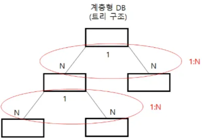

# Part 3. SQL 기본 및 활용

## Section 1. SQL 기본

### 관계형 데이터베이스 (Relation Database)

→ 데이터베이스와 데이터베이스 관리 시스템 차이점

- 데이터베이스
    - 데이터를 어떠한 형태의 자료구조로 사용하느냐에 따라 나누어짐
    - 종류
        - 계층형 ( 1 : N 관계)
            
            
            
            - 트리 형태의 자료구조에 데이터를 저장하고 관리
            - 네트워크는 오너(Owner)와 멤버(Member) 형태로 데이터 저장
        - 네트워크형 데이터베이스 ( 1 : N 혹은 M : N 관계)
            
            
            
        - 관계형 데이터베이스
            - 릴레이션에 데이터를 저장하고 관리
            - 릴레이션을 사용하여 집합 연산과 관계 연산 가능
            
- 데이터베이스 관리 시스템(DBMS)
    - 계층형 데이터베이스, 네트워크 데이터베이스, 관계형 데이터베이스 등을 관리하기 위한 s/w
    - Oracle, MS-SQL, My-SQL, Sybase 등
    
- 관계형 데이터베이스 집합 연산과 관계 연산
    - 집합 연산
        - 합집합(Union)
            - 두 개의 릴레이션을 하나로 합하는 것
            - 중복된 행(튜플)은 한 번만 조회
        - 차집합(Difference)
            - 본래 릴레이션에는 존재하고 다른 릴레이션에 존재하지 않는 것 조회
        - 교집합(Intersection)
            - 두 개의 릴레이션 간에 공통된 것 조회
        - 곱집합(Cartesian Product)
            - 각 릴레이션에 존재하는 모든 데이터를 조합하여 연산
    - 관계 연산
        - 선택 연산(Selection)
            - 릴레이션에서 조건에 맞는 행(튜플)만을 조회
        - 투영 연산(Projection)
            - 릴레이션에서 조건에 맞는 속성만 조회
        - 결합 연산(Join)
            - 여러 릴레이션의 공통된 속성을 사용해서 새로운 릴레이션 생성
        - 나누기 연산(Division)
            - 기존 릴레이션에서 나누는 릴레이션이 가지고 있는 속성과 동일한 값을 가지는 행(튜플)을 추출하고 나누는 릴레이션의 속성을 삭제한 후 중복된 행 제거
    

→ 테이블 구조


                                                                                             테이블 : EMP                                               테이블 : DEPT

- 기본키(Primary Key)는 하나의 테이블에서 유일성(Unique)과 최소성, Not NULL을 만족하면서 해당 테이블을 대표
- 외래키는 다른 테이블의 기본키를 참조(조인)하는 칼럼
    
    ⇒ 관계 연산 중 결합 연산(Join)을 하기 위해 사용
    

### SQL 종류

→ SQL(Structures Query Language)

- 관계형 데이터베이스에 대해 데이터의 구조를 정의, 데이터 조작, 데이터 제어 등 할 수 있는
    
    절차형 + 비절자형 언어
    
- 관계형 데이터베이스는 데이터베이스를 연결하고 SQL문을 사용하여 데이터베이스를 누구나 쉽게 사용할 수 있도록 함
- ANSI/ISO 표준을 준수하기 때문에 데이터베이스 관리 시스템이 변경되어도 그대로 사용 가능

→ ⭐⭐⭐**SQL 종류**


- DDL (Data Definition Language)
    - 관계형 데이터베이스이 구조를 정의하는 언어
    - 데이터베이스 테이블을 생성하거나 변경, 삭제하는 것으로 데이터를 저장할 구조를 정의
    - CREATE, ALTER, DROP, RENAME, TRUNCATE 문
- DML (Data Manipulation Language)
    - 테이블에서 데이터를 입력, 수정, 삭제, 조회
    - 데이터 구조에 데이터를 입력하거나 수정, 삭제, 조회
    - INSERT, UPDATE, DELETE, SELECT 문
- DCL (Data Control Language)
    - 데이터베이스 사용자에게 권한을 부여하거나 회수
    - 사용자가 접근할 수 있는지 권한 부여하는 것
    - GRANT, REVOKE 문
- TCL (Transaction Control Language)
    - 트랜젝션을 제어하는 명령어
    - COMMIT, ROLLBACK, SAVEPOINT 문
    
- 작업 순서
    
    ⇒ 데이터베이스의 사용자에게 권한을 부여하고 권한이 부여되면 DDL로 데이터 구조 정의
    
    ⇒ 데이터 구조가 정의되면 데이터를 입력한 후에 개발자 및 사용자가 그 데이터를 조회
    

→ 트랜잭션(Transaction)

- 특성
    - 원자성 (Atomicity)
        - 트랜잭션은 데이터베이스 연산의 전부가 실행되거나 전혀 실행되지 않아야 함
            
            (ALL OR NOTHING)
            
            ⇒ 트랜잭션의 처리가 완전히 끝나지 않았을 경우는 실행되지 않은 상태와 같음
            
    - 일관성 (Consistency)
        - 트랜잭션 실행 결과로 데이터베이스이 상태가 모순되지 않아야 함
        - 트랜잭션 실행 후에도 일관성 유지
    - 고립성 (Isolation)
        - 트랜잭션 실행 중에 생성하는 연산의 중간결과는 다른 트랜잭션이 접근 불가
            
            ⇒ 부분적인 실행결과를 다른 트랜잭션이 볼 수 없음
            
    - 영속성(Durability)
        - 트랜잭션이 그 실행을 성공적으로 완료하면 그 결과는 영구적으로 보장
- 세션 (Session)
    - 연결정보
    - 데이터베이스를 사용하기 위해 먼저 연결 → ID, 패스워드, IP주소, SID(데이터베이스명) 입력 → 연결되면 세션 생성
    - 데이터베이스에 입력, 수정, 삭제, 조회와 같은 명령을 실행하여 작업
        
        ⇒ 이러한 작업이 트랜잭션
        

→ SQL문의 실행 순서

- 개발자가 작성한 SQL문(DDL, DML, DCL 등)은 3단계를 걸쳐 실행
- SQL문의 문법을 검사하고 구문 분석 실행
- 구문 분석 이후 SQL을 실행 후 데이터 인출
- SQL 실행 순서
    1. 파싱 (Parsing)
        - SQL문의 문법을 확인하고 구문 분석
        - 구문 분석한 SQL문은 Libary Cache에 저장
    2. 실행 (Execution)
        - 옵티마이저가 수립한 실행 계획에 따라 SQL 실행
    3. 인출 (Fetch)
        - 데이터를 읽어 전송
- 사용자가 작성한 SQL문을 구문 분석한 결과는 라이브러리 캐시(Libary Cache)에 저장됨
- 소프트 파싱 : 동일한 SQL문을 한 번 더 실행하면 라이브러리 캐시에 저장된 구문 분석문을 재사용하게 되는 것
- 하트 파싱 : 구문 분석을 새롭게 하는 것

→ SELECT 문

1. SELECT 문 사용
    - 테이블에 입력된 데이터를 조회하기 위해 사용
    - 특정 칼럼이나 특정 행만 조회 가능
        
        ```sql
        SELECT * // 조회를 원하는 칼럼 선택 (모든 칼럼 -> *)
        FROM EMP // 조회를 원하는 테이블 지정
        WHERE 사원번호 == 1000; // 조회를 원하는 데이터의 조건 지정
        // 마지막에 끝날 때 세미콜론(;)
        ```
        
2. ORDER BY를 사용한 정렬
    - 데이터를 오름차순(Ascending) 혹은 내림차순(Desending)으로 출력
    - 모든 실행이 끝난 후 데이터 출력 전 실행
    - 대량의 데이터를 정렬하게 되면 정렬로 인한 성능 저하 발생
    - Oracle 데이터베이스는 정렬을 위해 메모리 내부에 할당된 SORT_AREA_SIZE를 사용하지만 사이즈가 작으면 성능 저하 발생
    - 정렬을 회피하기 위해서 인덱스를 생성할 때 사용자가 원하는 형태로 오름차순 또는 내림차순으로 생성
    - 특별한 지정이 없으면 오름차순으로 정렬
    
    ```sql
    SELECT 이름||'님' // 이름 뒤에 '님' 문자 결합
    FROM EMP
    ORDER BY 급여, 부서코드 DESC; // 급여는 오름차순, 부서코드는 내림차순으로 정렬
    ```
    
3. Index를 사용한 정렬 회피
    - 정렬은 Oracle 데이터베이스에 부하를 주므로, 인덱스를 사용해 ORDER BY 회피 가능
        
        
        | 사원번호 | 이름 | 나이 | 급여 | 부서코드 |
        | --- | --- | --- | --- | --- |
        | 1000 | 임베스트 | 20 | 10,000 | 001 |
        | 1001 | 강지영 | 22 | 21,000 | 002 |
        | 1002 | 김호동 | 32 | 32,000 | 002 |
    - 위에서 SELECT문을 실해아면 사원번호로 오름차순이 정렬되어 조회됨
        
        ```sql
        SELECT /*+INDEX_DESC(A) */ //사원번호로 생성된 인덱스를 내림차순으로 읽게 지정
        FROM EMP A;
        ```
        
    - 인덱스를 스캔한 후 해당 사원번호의 값을 가지고 테이블의 데이터 읽음
    - 테이블에서 해당 행을 찾으면 인출하여 사용자 화면에 조회
4. DISTINCT와 Alias
    1. DISTINCT
        - 칼럼명 앞에 지정하여 중복된 데이터를 한 번만 조회하게 함
        
        ```sql
        SELECT DISTINCT 부서코드 FROM EMP // 부서코드가 중복되지 않음
        ORDER BY 부서코드; // 부서코드를 오름차순으로 정렬
        ```
        
    2. Alias(별칭)
        - 테이블명이나 칼럼명이 너무 길어 간략하게 할 때 사용
        
        ```sql
        	SELECT 이름 AS "ENAME" // 칼럼명을 ENAME으로 출력
        FROM EMP A // EMP 테이블명 대신 'A'사용
        WITH A.사원번호 = 1000;
        ```
        

### WHERE문 사용

→ WHERE문이 사용되는 연산자

- 비교 연산자 (=, <, ≤, >, ≥)
- 부정비교 연산자
    - !=, ^=, < >, NOT 칼럼명 = : 같지 않은 것 조회
    - NOT 칼럼명 > : 크지 않은 것 조회
- 논리 연산자
    - AND : 조건 모두 만족해야 참
    - OR : 조건 중 하나만 만족해도 참
    - NOT : 참이면 거짓으로, 거짓이면 참으로 바꿈
- SQL 연산자
    - LIKE ‘%비교 문자열%’ : 비교 문자열을 조회 ‘%’는 모든 값을 의미
    - BETWEEN A AND B : A와 B사이의 값 조회
    - IN (list) : OR을 의미하며 list 값 중에 하나만 일치해도 조회
    - IS NULL : NULL값 조회
- 부정 SQL 연산자
    - NOT BETWEEN A AND B, NOT IN (list), IS NOT NULL

→ LIKE문 사용

- 와일드카드를 사용하여 데이터 조회
- 와일드 카드
    - %
        - 어떤 문자를 포함한 모든 것 조회
            
            (Ex. ‘조%’는 ‘조’로 시작하는 모든 문자 조회
            
    - _
        - 글자 수 한 개인 단일 문서
            
            (Ex. ‘_개’ → 1개, 2개 O,   100개 x)
            

→ BETWEEN문 사용

- BETWEEN 1000 AND 2000은 1000과 2000을 포함한 사이의 값 조회

→ IN문 사용

```sql
SELECT * FROM EMP
WHERE JOB IN ('CLERK', 'MANAGER'); // JOB이 'CLERK' 이거나 'MANAGER'인 레코드 조회
```

- ‘OR’의 의미를 가지고 있어 하나의 조건만 만족해도 조회 가능
- 괄호 (  )를 사용하여 원하는 데이터를 칼럼명에 대응하도록 입력함으로써, IN문으로 여러 개의 칼럼에 대한 조건 지정 가능

```sql
SELECT * FROM EMP
WHERE JOB, ENAME
IN ('CLERK', 'TEST1'), ('MANAGER', 'TEST4'); 
// 'CLERK' 직업을 가지고 'TEST1'이름이거나 'MANAGER'직업을 가지고 'TEST4'인 경우
```

→ NULL 값 조회

- NULL 특징
    - 모르는 값 의미
    - 값의 부재 의미
    - NULL과 숫자 혹은 날씨를 더하면 NULL됨
    - NULL과 어떤 값을 비교할 때, ‘알 수 없음’이 반환
- NULL 값 조회
    - NULL을 조회할 경우 IS NULL을 사용하고, NULL 값이 아닌 것을 조회할 경우 IS NOT NULL 사용
    
    ```sql
    SELECT * FROM EMP
    WHERE MGR IS NULL; // MGR 칼럼이 NULL인 값을 조회
    ```
    
    - NULL 관련 함수
        - NVL 함수 (Oracle)
            - NULL이면 다른 값으로 바꾸는 함수
            - ‘NVL(MGR,0)’은 MGR칼럼이 NULL 값이면 0으로 변경됨
        - NVL2 함수 (Oracle)
            - NVL 함수 + DECODE 함수
                - ‘NVL(MGR,1, 0)’은 MGR칼럼이 NULL 값이 아니면 1을, NULL 값이면 0을 반환
        - NULLIF함수 (Oracle, MS-SQL, MySQL)
            - 두 개의 값이 같으면 NULL을, 다르면 첫 번째 값을 반환
            - ‘NULLIF(aa1,as2)’는 aa1과 as2가 같으면 NULL을, 다르면 aa1을 반환
        - COALESCE (Oracle, MS-SQL)
            - NULL이 아닌 최초의 인자 값 반환
            - ‘COALECE(exp1, exp2, exp3, …)은 exp1이 NULL이 아니면 exp1의 값을, 그렇지 않으면 그 뒤의 값의 NULL여부를 판단하여 값 반환

### GROUP 연산

→ GROUP BY문

- 테이블에서 소규모 행을 그룹화하여 합계, 평균, 최댓값, 최솟값 등을 계산
- HAVING구에 조건문 사용
- Grouping된 결과에 대한 조건문 사용
- GROUP BY를 사용해 정렬 가능

```sql
SELECT DEPTNO, SUM(SAL)
FROM EMP
GROUP BY DEPTNO;
```

→ HAVING문 사용

- GROUP BY에 조건절을 사용하는 방법
- WHERE 절에 조건문을 사용하게 되면 조건을 충족하지 못하는 데이터들은 GROUP BY 대상에서 제외
    
    ```sql
    SELECT DEPTNO, SUM(SAL)
    FROM EMP
    GROUP BY DEPTNO
    HAVING SUM(SAL)>10000; // GROUP BY 결과에서 급여합계가 10000이상만 조회
    ```
    

→ 집계 함수 종류

- COUNT( ) : 테이블의 전체 행 수 조회, NULL값을 제외한 행 계산
- SUM( ) : 특정 칼럼의 합계 계산
- AVG( ) : 특정 칼럼의 평균 계산
- MAX( ), MIN( ) : 특정 칼럼의 최대 및 최소 값 계산
- STDDEV( ) : 특정 칼럼의 표준편차 계산
- VARIANCE( ) : 특정 칼럼의 분산 계산

→ COUNT 함수

- 행 수를 계산하는 함수
- COUNT(*)는 NULL 값을 포함한 모든 행 수 계산
- COUNT(칼럼명)은 NULL 값을 제외한 행 수 계산

### SELECT문 실행 순서

```sql
SELECT ename             // 5
FROM EMP                 // 1
WHERE empno = 10         // 2
GROUP BY ename           // 3
HAVING count(*) >= 1     // 4
ORDER BY ename;          // 6
```

 

### 명시적(Explicit) 형 변환과 암시적(Implicit) 형 변환

- 형 변환 : 두 개의 데이터의 데이터 타입(형)이 일치하도록 변환하는 것
- 명시적 형 변환
    - 함수를 사용해서 데이터 타입을 일치시키는 것
    - 개발자가 SQL을 사용할 때 형 변환 함수 사용
    - TO_NUMBER(문자열) : 문자열 → 숫자
    - TO_CHAR(숫자 혹은 날짜, [FORMAT]) : 숫자 혹은 날짜 → FORMAT의 문자
    - TO_DATE(문자열, FORMAT) : 문자열 → FORMAT의 날짜형
- 암시적 형 변환
    - 개발자가 형 변환을 하지 않은 경우 데이터베이스 관리 시스템이 자동으로 형 변환하는 것

### 내장형 함수(BUILT - IN Function)

→ 내장형 함수

- 모든 데이터베이스에는 SQL에서 사용할 수 있는 내장형 함수 존재
- DBMS 벤더별로 약간의 차이가 있지만, 거의 비슷한 방법 사용
- 형 변환 함수, 문자열 및 숫자형 함수, 날짜형 함수 존재

→ DUAL 테이블 (Oracle)

- Dummy 테이블 존재

→ 내장형 함수 종류

- 문자열 함수 (함수 여러개 중첩해서 사용 가능)
    - ASCII(문자) : 문자 혹은 숫자 → ASCII 코드 값으로 반환
    - CHR/CHAR(ASCII 코드값) : ASCII 코드 값 → 문자로 변환 (CHR : Oracle, 그 외에 CHAR)
    - SUBSET(문자열, m, n) : 문자열에서 m번째 위치부터 n개 자름
    - CONCAT(문자열1, 문자열2) : 문자열 1번과 2번 결합
    - LOWER(문자열) : 영문자를 소문자로 변환
    - UPPER(문자열) : 영문자를 대문자로 변환
    - LENGTH 혹은 LEN(문자열) : 공백을 포함한 문자열 길이
    - LTRM(문자열, 지정문자) : 왼쪽에서 지정된 문자 삭제, 지정된 문자 생략하면 공백을 삭제
    - RTRM(문자열, 지정문자) : 오른쪽에서 지정된 문자 삭제, 지정된 문자 생략하면 공백을 삭제
    - TRINM(문자열, 지정된 문자) : 왼쪽 및 오른쪽에서 지정된 문자 삭제,         //
    - REPLACE(문자열, 찾을 문자열, 대체 문자열) : 문자열의 일부를 교체
- 날짜형 함수
    - SYSDATE : 오늘의 날짜를 날짜 타입으로 알려줌
    - EXTRACT(field FROM source) : 날짜에서 년, 월, 일 조회
- 숫자형 함수
    - ABS(숫자) : 절댓값 반환/ 부호를 제거
    - SIGN(숫자) : 양수, 음수, 0을 구별
    - MOD(숫자1, 숫자2) : 숫자 1을 숫자 2로 나누어 나머지 계산(% 사용 가능)
    - CEIL/CEILING(숫자) : 특정 숫자보다 크거나 같은 최소의 정수 반환
    - FLOOR(숫자) : 특정 숫자보다 작거나 같은 최대의 정수 반환
    - ROUND(숫자 ,m) : 소수점 m자리에서 반올림 (m의 기본 값은 0)
    - TRUNC(숫자, m) : 소수점 m자리에서 절삭(m의 기본 값은 0)

### DECODE와 CASE문

→ DECODE문

- IF문 구현 가능
- 특정 조건이 참이면 A, 거짓이면 B로 응답

```sql
	DECODE(EMPNO, 1000, 'TRUE', 'FALSE')
	// EMPNO 값이 참이면 TRUE를 응답하고 거짓이면 FALSE를 응답
```

→ CASE문

- IF ~ THEN ~ ELSE - END의 프로그래밍 언어처럼 조건문 사용 가능
- WHEN 구에 사용
- 해당 조건이 참이면 THEN이 실행되고 거짓이면 ELSE구 실행

```sql
CASE  [expression]
	WHEN CONDITION_1 THEN result_1
	WHEN CONDITION_2 THEN result_2
	...
	WHEN CONDITION_n THEN result_n
	ELSE result
END
```

### WITH문

- 서브쿼리(Subquery)를 사용해서 임시 테이블이나 뷰처럼 사용할 수 있는 구문
- 서브쿼리 블록에 별칭 지정 가능
- 옵티마이저는 SQL을 인라인 뷰나 임시 테이블로 판단

## Section 2. SQL 활용

### 서브쿼리(Subquery)

→ Main query와 Subquery

- Subquery는 SELECT문 내에 다시 SELECT문을 사용하는 SQL문
- Subquery의 형태는 FROM구에 SELECT문을 사용하는 인라인 뷰와 SELECT문에 Subquery를 사용하는 스칼라 서브쿼리 등 존재
- WHERE구에 SELECT문을 사용

```sql
SELECT *
	FROM EMP
	WHERE DEPTNO =                    // MAIN QUERY
		(SELECT DEPTNO FROM DEPT
		WHERE DEPTNO=10);              // SUB QUERY
```

```sql
SELECT *
FROM (SELECT ROWNUM NUM, ENAME
			FROM EMP) a                 //인라인 뷰(Inline View) -> 가상의 테이블 만드는 효과
WHERE NUM < 5;
```

→ 단일 행 서브쿼리와 다중 행 서브쿼리

- 서브쿼리(Subquery)는 반환하는 행 수가 한 개인 것과 여러 개인 것에 따라서 단일 행 서브쿼리와 멀티 행 서브쿼리로 분류
- 단일 행 서브쿼리(Single Row Subquery)
    - 서브쿼리를 실행하면 그 결과는 반드시 한 행만 조회
    - 비교연산자(=, <, ≤, >, ≥,) 사용
- 다중 행 서브쿼리(Multi Row Subquery)
    - 서브쿼리를 실행하면 그 결과는 여러 개의 행 조회
    - 다중 행 비교 연산자(IN, ANY, ALL, EXISTS) 사용
    

→ 다중 행(Multi row) Subquery

- 서브쿼리 결과가 여러 개의 행을 반환하는 것으로 다중 행 연산자 사용
- 다중 행 비교 연산자
    - IN(Subquery)
        - Main query의 비교조건이 Subquery의 결과 중 하나만 동일하면 참(OR 조건)
    - ALL(Subquery)
        - Main query와 Subquery의 결과가 모두 동일하면 참
        - < ALL : 최솟값 반환
        - > ALL : 최댓값 반환
    - ANY(Subquery)
        - Main query의 비교조건이 Subquery의 결과 중 하나 이상 동일하면 참
        - < ANY : 하나라도 크게 되면 참
        - > ANY : 하나라도 작게 되면 참
    - EXISTS(Subquery)
        - Main query와 Subquery의 결과가 하나라도 존재하면 참

→ 스칼라(Scala) Subquery

: 반드시 한 행과 한 칼럼만 반환하는 서브쿼리

→ 연관(Correlated) Subquery

: Subquery 내에서 Main query 내의 칼럼을 사용하는 것

### 조인(Join)

→ EQUI(등가) JOIN(교집합)

1. EQUI JOIN
    - 조인 : 여러 개의 릴레이션을 사용해서 새로운 릴레이션을 만드는 과정
    - 조인의 가장 기본은 교집합을 만드는 것
    - 두 개의 테이블 간에 일치하는 것을 조인
        
        
        
    
    ```sql
    SELECT * FROM EMP, DEPT
    WHERE EMP.DEPTNO = DEPT.DEPTNO          // = 을 통해 두 테이블 연결
    	AND EMP.ENAME LIKE '임%'
    ORDER BY ENAME;
    ```
    
2. INNER JOIN
    - ON 문 사용해 테이블 연결
    
    ```sql
    SELECT * FROM EMP INNER JOIN DEPT
    ON EMP.DEPTNO = DEPT.DEPTNO
    	AND EMP.ENAME LIKE '임%'
    ORDER BY ENAME;
    ```
    
3. 해시 조인(HASH JOIN)
    - 테이블을 해시 메모리에 적재한 후에 해시 함수로 연결하는 방법
    - EQUI JOIN만 사용 가능
    - 후행 테이블의 조인 키를 사용해서 적용하여 해당 버킷을 검색
4. INTERSECT 연산
    - 두 개의 테이블에서 교집합 조회 ⇒ 두 개의 테이블에서 공통된 값 조회
    
    ```sql
    SELECT DEPTNO FROM EMP
    INTERSECT
    SELECT DEPTNO FROM DEPT;
    ```
    

→ Non-EQUI(비등기) JOIN

- 두 개의 테이블 간에 조인하는 경우 “=”을 사용하지 않고 “>, ≥, <, ≤”등 사용
- 정확하게 일치하지 않은 것을 조인

→ OUTER JOIN

- 두 테이블 간의 교집합을 조회하고 한 쪽 테이블에만 있는 데이터도 포함시켜 조회
- LEFT OUTER JOIN : 왼쪽 테이블만 있는 행도 포함

```sql
SELECT * FROM DEPT LEFT OUTER JOIN EMP
ON EMP.DEPTNO = DEPT.DEPTNO;
```

- RIGHT OUTER JOIN : 오른쪽 테이블만 있는 행도 포함
- FULL OUTER JOIN : LEFT OUTER JOIN + RIGHT OUTER JOIN
- Oracle 데이터베이스는 OUTER JOIN 시 ‘+’ 기호 사용 가능

→ CROSS JOIN

- 조인 조건구 없이 2개의 테이블을 하나로 조인
- 조인구가 없기 떄문에 카테시안 곱 발생
- 행이 14개 있는 테이블과 행이 4개 있는 테이블을 조인하면 56개의 행 조회 (14 * 4)

```sql
SELECT *
FROM EMP CROSS JOIN DEPTNO;
```

→ UNION을 사용한 합집합 구현

1. UNION
    - 두 개의 테이블을 하나로 만드는 연산
    - 두 개의 테이블의 칼럼 수, 칼럼의 데이터 형식 모두가 일치해야함 (불일치시 오류 발생)
    - 두 개의 테이블을 하나로 합치면서 중복된 데이터 제거 ⇒ 정렬 과정 발생
    
    ```sql
    SELECT DEPTNO FROM EMP
    UNION
    SELECT DPTNO FROM EMP;
    ```
    
2. UNION ALL
    - 두 개의 테이블을 하나로 만드는 연산
    - 중복을 제거하거나 정렬 유발 x

→ 차집합을 만드는 MINUS

- 먼저 쓴 SELECT문에 있고 뒤에 쓰는 SELECT문에 없는 집합 조회

### 그룹 함수(Group Function)

→ ROLLUP

- GROUP BY의 칼럼에 대해서 **Subtotal** 만드는 것
- GROUP BY ROLLUP(칼럼명)
- GROUP BY 그룹칼럼 WITH ROLLUP
- ROLLUP할 때 GROUP BY 구에 칼럼이 두 개 이상 오면 순서에 따라 결과 달라짐
1. 1차 ROLLUP
    - 가장 단순한 형태로 FROUP BY 구 ROLLUP에 하나의 칼럼을 사용하여 단순 총계 계산
    
    ```sql
    SELECT DECODE(DEPTNO, NULL, '전체 합계', DEPTNO),     
    // DEPTNO 가 NULL이면 '전체 합계' 문자 출력
     SUM(SAL)  
    FROM EMP
    GROUP BY ROLLUP(DEPTNO);
    // ROLLUP 사용하면 부서별 합계 및 전체합계 계산
    ```
    
2. 2차 ROLLUP
    - ROLLUP 내에 두 개의 칼럼을 사용하는 것으로 DEPTNO(부서별) 합계와 전체 총계 출력
    - 안쪽에 있는 칼럼에 대해 총계를 생성하고 전체 총계를 더 생성
    - ROLLUP으로 실행되는 칼럼별로 **Subtotal** 생성
    
    ```sql
    SELECT DEPTNO, JOB, SUM(SAL))
    FROM EMP
    GROUP BY ROLLUP(DEPTNO, JOB);
    // 부서별 합계, 직업별 합계, 전체 합계 모두 계산
    ```
    
3. 부분적 ROLLUP
    - GROUP BY 절이 ROLLUP에서 제외된 칼럼에 위치
    - 소계가 생성되지만 전체 총계는 생성x
    
    ```sql
    SELECT DEPTNO, EMPNO, SUM(SAL))
    FROM EMP
    GROUP BY DEPTNO, ROLLUP(EMPNO);
    // 전체 합계는 출력되지 않고 소계만 출력
    ```
    
4. ROLLUP을 사용한 전체 합계
    
    ```sql
    SELECT DEPTNO, EMPNO, ENAME, SUM(SAL))
    FROM EMP
    GROUP BY ROLLUP((DEPTNO, EMPNO,ENAME));
    // 그룹핑이 되는 데이터가 없어 전체 합계만 조회
    ```
    

→ GROUPING 함수

- ROLLUP, CUBE, GROUPING SETS에서 생성되는 합계 값을 구분하는 함수
    
    Ex) 소계, 합계 등이 계산되면 FROUPING 함수는 1을 반환하고, 그렇지 않으면 0을 반환하여 합계 값 식별 가능
    
- GROUPING 함수를 사용하면 사용자가 필요로 하는 데이터를 DELECT문으로 작성하여 제공 가능

→ GROUPIN SETS 함수

- GROUP BY에 나오는 칼럼의 순서와 관계없이 다양한 소계 생성 가능

```sql
SELECT DEPTNO, JOB, SUM(SAL)
FROM EMP
GROUP BY GROUPING SETS (DEPTNO, JOB);
// DEPTNO와 JOB을 각각의 그룹으로 합계 계산
```

→ CUBE 함수

- CUBE는 CUBE함수에 제시한 칼럼에 대해서 결합 가능한 모든 집계를 계산
- 다차원 집계를 제공하여 다양하게 데이터 분석 가능
    
    Ex) 부서와 직업을 CUBE로 사용하면 부서별 합계, 직업별 합계, 부서별 직업별 합계, 전체 합계 조회 가능
    
    ⇒ 조합할 수 있는 경우의 수가 모두 조합되며, 총 행 뿐만 아닌 모든 그룹 레벨에서 총계 출력
    
- ROLLUP과 CUBE 비교
    
    
    | ROLLUP | CUBE |
    | --- | --- |
    | 그룹핑 레벨별로 소계와 총계 제공 | 모든 가능한 조합의 소계와 총계가 제공 |
    | 상위 레벨에 속하는 하위 레벨의 결과가 중복됨 | 모든 조합을 포함하기 때문에 더 많은 중복 발생 |
    | NULL 값은 소계에서 제외 | NULL 값이 소계에 포함 |

### 윈도우 함수(Window Function)

→ 윈도우 함수

- 행과 행 간의 관계를 정의하기 위해서 제공되는 함수
- 윈도우 함수를 사용해서 순위, 합계, 평균, 행 위치 등 조작 가능
- 윈도우 함수 구조
    
    ```sql
    SELECT WINDIW_FUNCTION(ARGUMENTS)
    	OVER(PARTITION BY 칼럼 ORDER BY WINDOWING 절)
    FROM 테이블명;
    ```
    
- ARGUMENTS(인수) : 윈도우 함수에 따라서 0 ~N개의 인수 설정
- PARTITION BY : 전체 집합을 기준에 의해 소그룹으로 나눔
- ORDER BY : 어떤 항목에 대해서 정렬
- WINDOWING : 행 기준의 범위 지정
- GROUP BY와 윈도우 함수 차이점
    
    
    | 구분 | GROUP BY | 윈도우 함수 |
    | --- | --- | --- |
    | 기능 | 자르기와 집약 | 자르기 |
    | 특징 | GROUP BY구에 지정된 칼럼으로 데이터를 자르고 집계함수로 집약 | PARTITION BY구에 지정된 칼럼으로 데이터를 자름 |
    | 차이점 | 행 수가 감소 | 행 수는 유지 |
- WINDOWING
    - ROWS : 부분집합인 윈도우 크기를 물리적 단위로 행의 집합을 지정
    - RANGE : 논리적인 주소에 의해 행 집합을 지정
    - BETWEEN~ AND : 윈도우의 시작과 끝의 위치를 지정
    - UNBOUNDED PRECENDING : 윈도우의 시작 위치가 첫 번째 행임을 의미
    - UNBOUNDED FOLLOWING : 윈도우의 마지막 위치가 마지막 행임을 의미
    - CURRENT ROW : 윈도우 시작 위치가 현재 행임을 의미
    

→ 순위 함수(RANK Function)

- RANK 관련 윈도우 함수
    - RANK : 특정 항목 및 파티션에 대해 순위 계산, 동일한 순위는 동일한 값 부여
    - DENSE_RANK : 동일한 순위를 하나의 건수로 계산
    - ROW_NUMBER : 동일한 순위에 대해서 고유한 순위 부여
- Ex) RANK( ) OVER (OREDER BY SAL DESC) ⇒ SAL로 등수를 계산하고 내림차순으로 조회

→ 집계 함수(AGGREGATE Function)

- AGGREGATE 관련 윈도우 함수
    - SUM, AVG, SOUNT, MIN, MAX

```sql
SELECT ENAME, SAL,
	SUM(SAL) OVER (PARTITION BY MGR) SUM_MGR
	// 같은 MGR에 파티션을 만들고 합계 계산 => 같은 관리자의 급여 합계 보여줌
FROM EMP;
```

→ 행 순서 관련 함수

- 상위 행의 값을 하위에 출력하거나 하위 행의 값을 상위 행에 출력 가능
- 특정 위치에 행 출력 가능
- 행 순서 관련 윈도우 함수
    - FIRST_VALUE
        - 파티션에서 가장 처음에 나오는 값 구하기
        - MIN 함수를 사용해서 같은 결과 구하기 가능
    - LAST_VALUE
        - 파티션에서 가장 나중에 나오는 값 구하기
        - MAX 함수를 사용해서 같은 결과 구하기 가능
    - LAG
        - 이전 행 가지고 오기
    - LEAD
        - 윈도우에서 특정 위치의 행 가져오기
        - 기본 값은 1

→ 비율 관련 함수

- 비율 관련 함수는 누적 백분율, 순서별 백분율, 파티션을 N분으로 분할한 결과 등 조회 가능
- 비율 관련 윈도우 함수
    - CUME_DIST
        - 파티션 전체 건수에서 현재 행보다 작거나 같은 건수에 대한 누적 백분율 조회
        - 누적 분포상에 위치를 0 ~ 1 사이의 값을 가짐
    - PERCENT_RANK
        - 파티션에서 제일 먼저 나온 것을 0으로 제일 늦게 나온 것을 1로 하여 같이 아닌 행의 순서별 백분율 조회
    - NTILE
        - 파티션별로 전체 건수를 ARGUMENT 값으로 N 등분한 결과 조회
    - RATIO_TO_REPORT
        - 파티션 내에 전체 SUM(칼럼)에 대한 행 별 칼럼 값의 백분율을 소수점까지 조회

### Top N 쿼리

→ ROWNUM

- ORACLE 데이터베이스의 SELECT문 결과에 대해 논리적인 일련번호 부여
- 조회되는 행 수를 제한할 때 많이 사용함
- 화면에 데이터를 출력할 때 부여되는 논리적 순번

→ ROWID

- ORACLE 데이터베이스 내에서 데이터를 구분할 수 있는 유일한 값
- 데이터가 어떤 데이터 파일, 어느 블록에 저장되어 있는지 식별 가능
- ROWID 구조
    
    
    | 구조 | 길이 | 설명 |
    | --- | --- | --- |
    | 오브젝트 번호 | 1 ~ 6  | 오브젝트 별로 유일한 값을 가지고 있으며, 해당 오브젝트가 속해 있는 값 |
    | 상대 파일 번호 | 7 ~ 9 | 테이블스페이스에 속해 있는 데이터 파일에 대한 상대 파일번호 |
    | 블록 번호 | 10 ~ 15 | 데이터 파일 내부에서 어느 블록에 데이터가 있는지 알려줌 |
    | 데이터 번호 | 16 ~ 18 | 데이터 블록에 데이터가 저장되어 있는 순서 의미 |

### 계층형 조회(CONNECT BY)

- ORACLE 데이터베이스에서 지원하는 것으로 계층형으로 데이터를 조회 가능
- 트리 형태의 구조로 질의를 수행하는 것
- 조인 조건 : CONNECT BY JOIN
- MAX(LEVEL)을 사용하여 최대 계층 수 구하기 가능
    
    ⇒ 계층형 구조에서 마지막 Leaf Node의 계층값 구하기
    
- 계층형 조회
    - START_WITH 조건 : Connect by이 시작 위치를 지정
    - PRIOR 자식 = 부모 : 부모에서 자식방향으로 순방향 전개
    - PRIOR 부모 = 자식 : 자식에서 부모방향으로 역방향 전개
    - Order aiblings by 칼럼명 : 동일한 레벨인 형제 노드를 정렬

### PIVOT과 UNPIVOT

- PIVOT : 테이블에서 하나의 칼럼에 있는 행 값들을 펼쳐 각각의 하나의 칼럼으로 만들어 주는 것
- PIVOT : 데이터를 행 기반에서 열 기반으로 바꾸는 것
- UNPIVOT : 열 기반에서 행 기반으로 바꾸는 것

### 테이블 파티션(Table Partition)

→ Partition 기능

- 대용량의 테이블을 여러 개의 데이터 파일에 분리해서 저장
- 테이블의 데이터가 물리적으로 분리된 데이터 파일에 저장되면 입력, 수정, 삭제, 조회 성능이 향상
- 각각의 파티션 별로 독립적으로 관리 가능
- 파티션별로 백업하고 복구가 가능하면 파티션 전용 인덱스 생성 가능
- 파티션은 ORACLE 데이터베이스의 논리적 관리 단위인 테이블 스페이스 간에 이동 가능
- 데이터를 조회할 때 데이터의 범위를 줄여 성능 향상시킴

→ Range Partition

: 테이블의 칼럼 중에서 값의 범위를 기준으로 여러 개의 파티션으로 데이터를 나누어 저장

→ List Partition

: 특정 값을 기준으로 분할하는 방법

→ Hash Partition

: 데이터베이스 관리 시스템이 내부적으로 해시 함수를 사용해 데이터 분할

- 결과적으로 데이터베이스 관리 시스템이 알아서 분할하고 관리하는 것

→ 파티션 인덱스

- Global Index : 여러 개의 파티션에서 하나의 인덱스 제공
- Local Index : 해당 파티션별로 각자의 인덱스 사용
- Prefixed Index : 파티션 키와 인덱스 키가 동일
- Non prefixed Index : 파티션 키와 인덱스 키가 불일치

### 정규 표현식(Regular Expression)

→ 정규표현식 

: 특정한 규칙을 가지고 있는 문자열 집합을 표현하기 위해 사용되는 형식

- Oracle  정규 표현식
    - REGEXP_LIKE : LIKE문과 유사하고 정규표현식을 검색
    - REGEXP_REPLACE : 정규표현식을 검색한 후에 문자열을 변경
    - REGEXP_INSTR : 정규표현식을 검색하고 위치를 반환
    - REGEXP_SUBSTR : 정규표현식을 검색하고 문자열을 추출
    - REGEXP_COUNT : 정규표현식을 검색하고 발견된 횟수를 반환
- 정규표현식을 사용하기 위한 메타문자
    - . : 임의의 한 문자
    - ? : 앞 문자가 없거나 하나
    - + : 앞 문자가 하나 이상
    - * : 앞 문자가 0개 이상
    - {m} : 선행 표현식이 정확히 m번 발생
    - {m.} : 선행 표현식이 최소 m번 발생
    - {m,n} : 선행 표현식이 최소 m번 이상 최대 n번 이하 발생
    - […] : 괄호 안의 리스트에 있는 임의의 단일문자와 일치
    - |  : OR 의미
    - ^ : 문자열 시작 부분과 일치
    - [^] : 해당 문자에 해당하지 않는 한 문자
    - $ : 문자열의 끝 부분과 일치
    - [₩](https://ko.wikipedia.org/wiki/%E2%82%A9) : 표현식에서 후속 문자를 일반문자로 처리
    - [₩](https://ko.wikipedia.org/wiki/%E2%82%A9)n : 괄호 안에 그룹화 된 n번째 선행 하위식과 일치
    - [₩](https://ko.wikipedia.org/wiki/%E2%82%A9)d : 숫자 문자
    - [:class:]
        - 지정된 POSIX 문자 클래스에 속한 임의의 문자와 일치
        - [:alpha:] : 알파벳 문자
        - [:digit:] : 숫자
        - [:lower:] : 소문자, [:upper:] : 대문자
        - [:alnum:] : 알파벳 및 숫자
        - [:space:] : 공백 문자, [:punct:] : 특수 문자
        - [;cntrl:] : 컨트롤 문자
        - [:print:] : 출력 가능한 문자
    - [^:class:] : 괄호 안의 리스트에 없는 임의의 단일 문자와 일치

## Section 3. 관리 구문

### DML(Data Manipulation Language)

→ INSERT문

1. INSERT문
    - 테이블에 데이터를 입력하는 DML문
    
    **INSERT INTO** table (column1, column2, …) **VALUES** (expression1, expression2, …)
    
    - EMP 테이블에 데이터를 삽입하려면 테이블명, 칼럼명, 데이터 순으로 입력
    - 데이터를 입력할 때 문자열을 입력하는 경우 작은 따옴표(’  ‘)사용
    - 만약 특정 테이블의 모든 칼럼에 대한 데이터를 삽입하는 경우 칼럼명 생략 가능
    - INSERT문을 실행했다고 데이터 파일 저장 X, 최종 저장을 위해서는 COMMIT 실행
        
        (AUTO COMMIT(Set auto commit on) 실행 시 자동 저장)
        
2. SELECT문으로 입력
    - SELECT문을 사용하여 데이터를 조회해서 해당 테이블에 바로 삽입 가능
    - 단, 입력되는 테이블은 사전 생성 필수
    
    ```sql
    INSERT INTO DEPT_TEST // DEPT 테이블의 모든 데이터를 조회해서 DEPT_EST테이블에 입력
    SELECT * FROM DEPT;
    ```
    
3. Nologging 사용
    - 데이터베이스에 데이터를 입력하면 로그파일(Log file)에 그 정보 기록
    - Check point라는 이벤트가 발생하면 로그파일의 데이터를 데이터 파일에 저장
    - Nologging 옵션은 로그파일의 기록을 최소화시켜서 입력 시 성능을 향상시키는 방법
    - Buffer check라는 메모리 영역을 생략하고 기록
        
        **ALTER TABLE** DEPT **NOLOGGING**; 
        
        ⇒ 로그 파일의 기록을 최소화하여 입력 성능 향상
        

→ UPDATE문

- 입력된 데이터의 값 수정 시 사용
- UPDATE 문을 사용하여 원하는 조건으로 데이터를 검색해서 해당 데이터 수정
- **만약, UPDATE문에 조건문을 사용하지 않으면 모든 데이터가 수정됨**
- 데이터를 수정할 때 조건절에서 검색되는 행 수 만큼 수정

```sql
UPDATE DEPT              // 수정되는 테이블
	SET ENAME = "주문"     // ENAME 칼럼의 값을 '주문'으로 변경
WHERE EMPNO = 100;       // EMP 테이블에서 EMPNO가 100번인 직원을 수정(조건문)
```

→ DELETE문

- 원하는 조건을 검색해서 해당되는 행 삭제
- **만약, DELETE문에 조건문을 사용하지 않으면 모든 데이터가 수정됨** ⇒ 테이블의 모든 데이터 삭제
- DELETE문으로 데이터를 삭제한다고 해서 테이블의 용량이 초기화되진 않음
    
    ```sql
    DELETE FROM EMP
    	WHERE EMPNO = 100; // EMP 테이블에서 EMPNO가 100번인 직원 삭제
    ```
    
- WHERE 절(조건)을 입력하지 않으면 EMP 테이블의 모든 데이터가 삭제
- 테이블의 모든 데이터 삭제
    - DELETE FROM 테이블명 ;
        - 테이블의 모든 데이터 삭제
        - 데이터가 삭제되어도 테이블의 용량은 감소 X
    - TRUNCATE TABLE 테이블명 ;
        - 테이블의 모든 데이터 삭제
        - 데이터가 삭제되면 테이블의 용량 초기화

### TCL(Transaction Control Language)

→ COMMIT

- INSERT, UPDATE, DELETE문으로 변경한 데이터를 데이터베이스에 반영
- 변경 이전 데이터는 잃어버림
- 디른 모든 데이터베이스 사용자는 변경된 데이터 볼 수 있음
- COMMIT은 완료되면 데이터베이스 변경으로 인한 LOCK 해제(UNLOCK)됨
- COMMIT은 완료되면 다른 모든 데이터베이스 사용자는 변경된 데이터 조작 가능
- COMMIT을 실행하면 하나의 트랜잭션 과정을 종료
- ORACLE 데이터베이스는 암시적 트랜잭션 관리
    
    ⇒ ORACLE 데이터베이스로 트랜잭션을 시작하고 트랜잭션 종료는 ORACLE 데이터베이스 사용자가 COMMIT 혹은 ROLLBACK으로 처리
    

→ ROLLBACK

- ROLLBACK을 실행하면 데이터에 대한 변경 사용을 모두 취소하고 트랜잭션을 종료
- INSERT, UPDATE, DELETE문의 작업을 모두 취소
    
    ⇒ 이전에 COMMIT 한 곳까지만 복구
    
- ROLLBACK을 실행하면 LOCK이 해제되고 다른 사용자도 데이터베이스 행 조작 가능

→ SAVEPOINT(저장점)

- SAVEPOINT는 트랜잭션을 작게 분할하여 관리하는 것
- SAVEPOINT를 사용하면 지정된 위치 이후의 트랜잭션만 ROLLBACK 가능
- **SAVEPOINT <SAVEPOINT명>**
- 지정된 SAVEPOINT까지만 데이터 변경을 취소하고 싶은 경우 : “**ROLLBACK TO <SAVEPOINT명>**”

### DDL(Data Definition Language)

→ 테이블(Table) 생성

- 데이터베이스를 사용하기 위해서는 테이블을 먼저 생성
- Create Table
    - 새로운 테이블 생성
    - 테이블을 생성할 때 기본키, 외래키, 제약사항 등 설정 가능
- Alter Table
    - 생성된 테이블 변경
    - 칼럼을 추가하거나 변경, 삭제
    - 기본키를 설정하거나, 외래키 설정 가능
- Drop Table
    - 해당 테이블 삭제
    - 테이블의 데이터 구조 뿐만 아니라 저장된 데이터 모두 삭제

1. 기본적인 테이블 생성
    
    ```sql
    CREATE Table 테이블명
    (
    	칼럼명1 데이터타입(데이터 길이) PRIMARY KEY,
    	칼럼명2 데이터타입(데이터 길이), ...
    );
    
    DESC 테이블명; //칼럼명1 데이터 구조 확인
    ```
    
2. 제약조건 사용
    - 기본키, 외래키, 기본값, NOT NULL 등 테이블 생성할 떄 지정 가능
    
    ```sql
    CREATE Table 테이블명
    (
    	칼럼명1 데이터타입(데이터 길이),
    	칼럼명2 데이터타입(데이터 길이) DEFAULT 0,  // 미입력시 기본 값을 0으로 지정
    	칼럼명3 데이터타입(데이터 길이) NOT NULL,   // 미입력 불가
    	칼럼명4 데이터타입(데이터 길이), ... ,
    	CONSTRAINT 기본키 이름 PRIMARY KEY(칼럼명n)    // CONSTRAINT 사용해 기본키 지정
    );
    
    DESC 테이블명; //칼럼명1 데이터 구조 확인
    ```
    
3. 테이블 생성 시 CASECADE 사용
    - CASECADE 옵션은 참조 관계(기본키와 외래키 관계)가 있을 경우 참조되는 데이터를 자동으로 반영시킴

→ 테이블 변경

- ALTER TABLE문으로 테이블명 변경, 칼럼 추가, 변경, 삭제 등과 같이 테이블 변경
- 테이블 변경 : **ALTER TABLE** 전 테이블명 **RENAME TO** 새 테이블명
- 칼럼 추가 : **ALTER TABLE** 테이블명 **ADD** (칼럼명 데이터타입…)
- 칼럼 변경 : **ALTER TABLE** 테이블명 **MODIFY** (칼럼명, 데이터 타입 …)
    
    ⇒ 데이터 타입이나 길이 변경, 제약조건 설정, 기존 데이터 있을 경우 오류 발생
    
- 칼럼 삭제 : **ALTER TABLE** 테이블명 **DROP COLUMN** 칼럼명
- 칼럼명 변경 : **ALTER TABLE** 테이블명 **RENAME COLUMN** 전 칼럼명 **TO** 새 칼럼명

→ 테이블 삭제

- DROP TABLE문 사용해 삭제
- 데이터의 구조와 데이터 모두 삭제
- **DROP TABLE** 테이블명;
- **DROP TABLE** 테이블명 **CASECADE CONSTRAINT**;
    
    ⇒ 해당 테이블의 데이터를 외래키로 참조한 슬레이브 테이블과 관련된 제약사항 모두 삭제
    

→ 뷰(View) 생성과 삭제

- View : 테이블로부터 유도된 가상의 테이블
- 실제 테이터를 가지고있지 않고 테이블을 참조해서 원하는 칼럼만을 조회
- 데이터 딕셔너리(Date Dictionary)에 SQL문 형태로 저장되고 실행 시에 참조
- 특징
    - 참조한 테이블이 변경되면 뷰도 변경
    - 뷰의 검색은 참조한 테이블과 동일하게 할 수 있지만, 뷰에 대한 입력, 수정, 삭제에는 재약있음
    - 특정 칼럼만 조회시켜서 보안성 향상 가능
    - 한 번 생성된 뷰는 변경할 수 없고 변경을 원하면 삭제 후 재생성
    - ALTER문을 사용한 뷰 변경 불가
- CREATE VIEW문을 사용하여 뷰 생성(참조할 테이블은 SELECT문 사용)

```sql
CREATE VIEW 테이블명 AS
	SELECT * FROM 테이블명2;
```

- VIEW 조회는 SELECT문을 사용해 일반 테이블처럼 조회
- VIEW DROP을 사용해 뷰 삭제 가능 ⇒ 뷰를 삭제한다고 잠조했던 테이블이 삭제 X
- 장점
    - 특정 칼럼만 조회할 수 있기 때문에 보안 가능
    - 데이터 관리 간단
    - SELECT문이 간단해짐 (문법이 간단해짐)
    - 하나의 테이블에 여러 개의 뷰 생성 가능
- 단점
    - 단독적인 인덱스 생성 X
    - 삽입, 수정, 삭제 연산 제약 발생
    - 데이터 구조 변경 불가

### DCL(Data Control Language)

→ GRANT

- GRANT문은 데이터베이스 사용자에게 권한 부여
- 데이터베이스 사용을 위해서 권한이 필요하며 연결, 입력, 수정, 삭제, 조회 가능
- **GRANT** privileges **ON** 테이블명 **TO** user;
- privileges(권한) ⇒ 여러개 사용 가능
    - SELECT, INSERT, UPDATE, DELETE, REFERENCES, ALTER, INDEX, ALL
- WITH GRANT OPTION
    - 특정 사용자에게 권한을 부여할 수 있는 권한 부여
    - 권한을 A 사용자가 B에 부여하고 B가 C에게 권한을 부여한 후 권한을 취소하면 모든 권한 회수
- WITH ADMIN OPTION
    - 테이블에 대한 모든 권한 부여
    - 권한을 A 사용자가 B에 부여하고 B가 C에게 부여한 후 권한을 취소하면 B 사용자 권한만 취소

```sql
GRANT SELECT, INSERT, UPDATE, DELETE  // 4가지 권한 부여
ON 테이블명
TO 사용자 WITH GRANT OPTION;          // 권한을 부여할 수 있는 권한 부여
```

→ REVOKE

- REVOKE문은 데이터베이스 사용자에게 부여된 권한을 회수
- REVOKE privileges ON 테이블명 **TO** user;